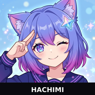

> [!NOTE]
> The owner of this repo built this entirely via vibe coding, and isn't quite sure what this Agent actually does. ¯\\\_(ツ)\_/¯

<div align="center">



# Hachimi Scan 🐾

**A lightweight, privacy-first Android document scanner, built 100% via vibe coding.**

[](LICENSE)
[](specs/LICENSE)
[](https://developer.android.com)
[](app/src/main/cpp)
[](https://developer.android.com/jetpack/compose)
[](https://deepmind.google)

*An offline-first Android document scanner crafted with pure vibe coding. Zero ads, zero tracking, zero network permissions.*

[English](README.md) | [简体中文](README_zh.md) | [Download Releases](https://github.com/eviau512/Hachimi-Scan/releases)

</div>

---

## 🌟 Features

### 1. Screen HDR & Burst Anti-Overexposure (SPEC_08)
* **Dynamic EV Bracketing Pipeline**:
  - Solves severe overexposure and saturation blowout when photographing luminous computer monitors, laptops, and tablets.
  - Automatically captures a rapid three-frame exposure bracket (`EV 0` / `EV -2.0` / `EV 0`) upon steady detection, pulling clipped screen highlights back into the camera sensor's linear range.
* **Tom Mertens Multi-Exposure Fusion**:
  - Seamlessly fuses bracketed frames using multi-scale Laplacian/Gaussian pyramids weighted by well-exposedness, contrast, and saturation, completely preventing halo artifacts around bright screen borders.
* **Subpixel Stabilization & Motion De-Ghosting**:
  - Full-frame ORB feature detection + RANSAC 8-DoF homography alignment corrects physiological hand tremors.
  - Strict motion de-ghosting threshold ($\Delta_{\text{diff}} \le 22$) filters out misaligned pixels, ensuring crisp, ghost-free typography.
* **Hard Specular Glare Replacement**:
  - Overexposed saturated patches (RGB > 238) on screens are replaced with sharp, unclipped details from underexposed frames.

### 2. Document Enhancement Filters
* **Retinex Magic Color**:
  - CIE-Lab color space illumination separation isolates the low-frequency L channel.
  - Illumination division ($R = S / L \times 255$) and dynamic white balancing eliminate paper wrinkles and cast shadows while preserving colorful highlighter ink and official seals.
* **Sauvola Adaptive Binarization (B&W Document)**：
  - Accelerated via integral images to compute local dynamic thresholds, erasing background copy noise while maintaining ultra-fine text strokes.
* **Smooth Grayscale**:
  - High dynamic range contrast stretching tailored for pencil sketches, receipts, and ID card photocopies.

### 3. Perspective Correction & Aspect Ratio Presets
* **Bottom Aspect Ratio Banner**:
  - Clean horizontal capsule banner positioned directly above filter controls, keeping the entire cropping canvas completely clear of obstructions.
  - Instant presets: `A4`, `A3`, `4:3`, `16:9`, `8:7` (full modern sensor ratio and presentation slides), and freeform `Custom`.
* **Foreshortening Recovery**:
  - Automatically compensates for geometric compression caused by tilted angles, restoring the document's true physical aspect ratio.

### 4. Edge Detection & Fine-Tuning
* **LSD Structural Line Detection & Magnetic Snapping**:
  - Intelligently recognizes physical paper boundaries with magnetic point and line snapping.
* **2.8x Floating Loupe**:
  - High-precision crosshair magnifying glass displays during handle adjustment for pixel-perfect corner alignment.

### 5. Interaction & Gestures
* **Three-Stage Focal Zoom & Pan**:
  - Double-tap focal zoom: `1.0x` $\to$ `2.5x` $\to$ `4.5x` $\to$ `1.0x`, centering on the tapped point.
  - Smooth two-finger pinch-to-zoom (`1.0x ~ 5.0x`) with spring-damped viewport boundary snapping.
* **Smooth 90° Rotation Transitions**.

### 6. Offline & Privacy-First
* **100% On-Device Processing**: All image processing (C++ NDK + OpenCV) runs entirely locally.
* **Zero Telemetry**: No user accounts, no network access permissions, no third-party tracking or analytics SDKs.

---

## 🛠️ Build & Run

### Prerequisites
* Android Studio Ladybug (2024.2.1) or newer
* Android SDK 35 (Android 15)
* Android NDK 26+ / 30
* JDK 17 or JDK 21
* CMake 3.22.1+

### Build via Command Line

```bash
# Clone the repository
git clone https://github.com/eviau512/Hachimi-Scan.git
cd Hachimi-Scan

# Build Hachimi Release APK (with auto-configured signing)
./gradlew assembleHachimiRelease

# Or build Standard Release APK
./gradlew assembleStandardRelease
```

Generated APKs are located at `app/build/outputs/apk/hachimi/release/`.

---

## 📄 License & Copyright Notice

This project utilizes a tiered licensing policy:

* **Source Code**: Licensed under the **[GNU General Public License v3 (GPLv3)](LICENSE)**, ensuring open and free access to all algorithms and code.
* **Technical Specifications (`specs/`)**: Dedicated to the public domain under **[Creative Commons Zero v1.0 (CC0 1.0)](specs/LICENSE)** for open academic and clean-room reference.
* **Application Icon & Visual Artwork**:
  - The application icon and character illustrations are derived from Chinese internet community fan comics (originating from "LLM-chan" / Dafeiyu comics culture). The project maintainer does not hold exclusive or original copyright over these visual assets.
  - As original upstream licensing policies and ShareAlike terms are not formally defined, **this project claims no proprietary copyright over these artistic depictions**; assets are used solely for open-source community non-commercial demonstration.
  - If original artists have inquiries or requests regarding visual asset usage, please open an Issue and we will promptly replace or remove them.
  - ⚠️ **Notice for Downstream Distributors**: If redistributing, modifying, or commercializing this project, please exercise caution regarding visual asset rights; it is strongly recommended to replace the launcher icons and illustrations with your own proprietary artwork.

---

## 🤖 Acknowledgments

This project was developed through collaborative pair programming (vibe coding) between the author and **[Google Antigravity](https://deepmind.google)** (Advanced Agentic Coding AI), covering the entire native C++ NDK image processing pipeline and Jetpack Compose modern UI.

---

## ⚖️ Disclaimer & Trademark Notice

1. **Regarding "Hachimi"**:
   - "Hachimi" is a popular internet community meme and pet term originating from ACG pop culture.
   - The name `Hachimi Scan` is used purely as an open-source project identifier and cultural tribute.
   - **The developers do not own, nor do they claim, any exclusive trademark or proprietary rights over the word "Hachimi".**

2. **Non-Affiliation & Trademarks**:
   - This project is an independent free and open-source utility and is not affiliated with, endorsed by, or sponsored by Cygames or any other entities.
   - All product names, trademarks, and registered trademarks mentioned herein are the property of their respective owners.
